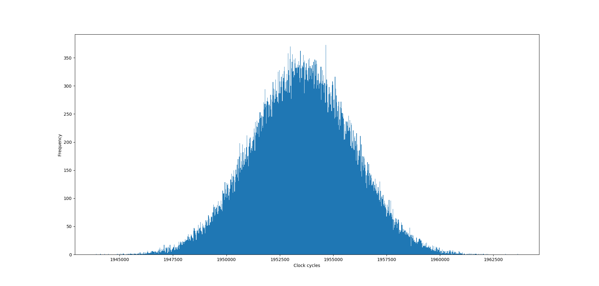
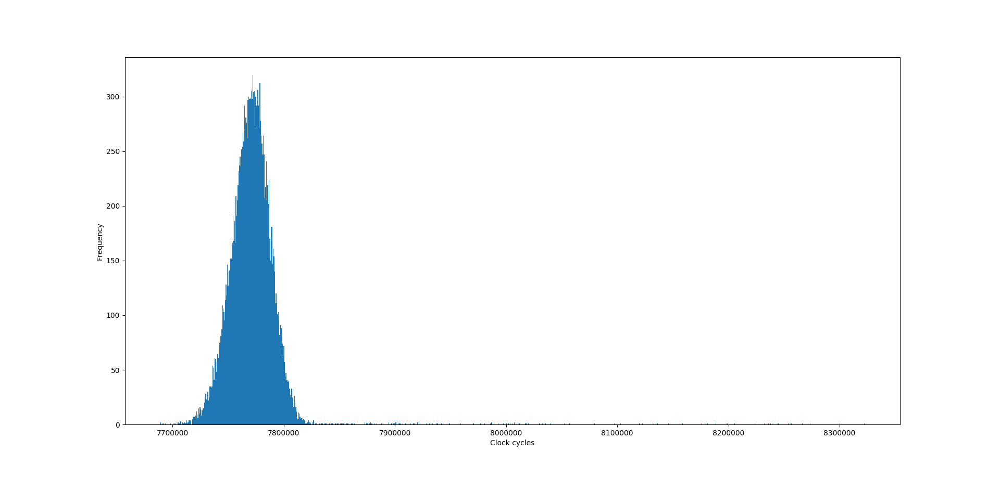

# Timing Side Channel Attack Report
This report shows the steps we have been through before getting to the final result. According to the actual chronological order those steps have been performed, the main sections are:

* [Theoretical references](#theoretical-references)
  * [Side channel attack](#side-channel-attack)
  * [Montgomery based RSA encryption](#montgomery-based-rsa-encryption)
* [Code development](#code-development)
  * [Big integer library](#big-integer-library)
    * [Data type](#data-type)
    * [Operations](#operations)
  * [RSA ecryption](#rsa-ecryption)
  * [Code validation](#code-validation)
* [Data acquisition](#data-acquisition)
  * [Bare metal Zybo Board acquisition](bare-metal-zybo-board-acquisition)
  * [OS acquisition](os-acquisition)
* [Attack](#attack)
  * [Attack algorithm](#attack-algorithm)
    * [First implementation attempt](#first-implementation-attempt)
    * [Final implementation](#final-implementation)
    * [Codes](#codes)
      * [Python](#python)
      * [C](#c)
  * [Attack results](#attack-results)
    * [Launch the attack](#launch-the-attack)
    * [Results](#results)
* [Countermeasures](#countermeasures)
  * [Theory](#theory)
  * [Results](#results)
* [Conclusions](#conclusions)
* [Improvements](#improvements)

Before starting, clone the git repository and get into it:

```bash
$ git config --global user.name "John Doe"
$ git config --global user.email johndoe@example.com
$ cd some-where
$ git clone git@gitlab.eurecom.fr:roggero/tsca.git
$ cd tsca
```

## Theoretical references

### Side channel attack
The name side channel attack refers to any attack based on a certain amount of information obtained from a computer system on which statistics could be computed. Relating those probabilistic statistics to the actual knowledge of the internal operation of the system, secrets related to the internal operations themselves could be disclosed.

In our case, the attack will be a timing attack on an RSA crypto-computation (Montgomery modular algorithm based ). This means that, basing on the knowledge of the actual algorithm used by the encryption and exploiting its timing weaknesses, the attacker could obtain timing measurements on a series of encryptions and could analyze them, disclosing the secret key. More on the Montgomery based RSA encryption is explained in the section [Montgomery based RSA encryption](#montgomery-based-rsa-encryption), while for the attack algorithm employed refer to [Attack algorithm](#attack-algorithm).

### Montgomery based RSA encryption
The RSA ecryption algorithm involves two steps:

* key pair generation

* modular exponentiation and multiplication based encryption

For the key pair generation, first two distinct large prime number (`p`,`q`) have to be found. Then, the modulus `n` is computed as the product of the two prime numbers. The Eulero's totient `t` is successively computed as the product

$`t = (p-1) \cdot (q-1)`$

and the public exponent `e` is chosen such that

$`1 < e < t`$

and

$`gcd(e,t) = 1`$ .

Finally, the secret exponent `d` is chosen such that

$`d \cdot e = 1 \; mod \; t`$ .

The pair `(n,e)` constitutes the public key, while the pair `(n,d)` the secret one.

To perform the encryption of a message `m` to obtain the chiphertext `c`, the following operation is performed:

$`c = m^e \; mod \; n`$ .

This computation consists of two main operations: modular multiplication and exponentiation. The implementation we adopted takes advantage instead of the Montgomery multiplication: the multiplier digits are consumed in the reverse order and no full length comparisons are required for the modular reductions (refer to [Colin D. Walter paper] on the topic). The basic pseudo-code it defines for the Montgomery modular multiplication is:

```text
s = 0;
for i = 0 to nb-1 do
  qi = (s0 + aib0) x (-n0^-1) mod r;
  s = (s + ai x b + qi x n) div r;
end for;
return s;
```

where:
* `s` is the multiplication result (`s0` is LSB of `s`);
* `nb` is the total number of bits of the secret key (more precisely, it should be "an upper bound on the number of digits needed for any number encountered": as underlined later, we discovered that nb+2 is a reliable upper bound);
* `n` is the modulus (`n0` is LSB of `n`);
* `r` is the radix (power of 2);
* `a` and `a` are the two exponentiation operands (`ai` is the i-th bit of `a` and `b0` is the LSB of `a`) which are passed by the Montgomery exponentiation function, where they are used:

  ```text
  c = MM(k0,1,n);
  s = MM(k0,m,n);
  for i = 0 to nb-1 do
    if (ei = 1) then
      c = MM(c,s,n);
    end if;
    s = MM(s,s,n);
  end if;
  e = lsr(e,1);
  c = MM(c,1,n);
  return c;
  ```

  where:

  * `MM(a,b,n)` is the Montgomery multiplication defined by the previous algorithm;
  * `c` is the chiphertext;
  * `s` is squaring variable, updated at each iteration;
  * `m` is the message;
  * `e` is the public exponent (`ei` is bit i-th of `e`);
  * `k0` is

    $`k_0 = 2^n`$

    where `n` is the modulus computed before.

## Code development

The starting point to get a working implementation for the Montgomery based RSA encryption is having a library capable of managing integers on a large number of bits (such as 1024 or 2048), since this will be most likely the size that will be used by most of the main core variables (private and public key, for instance). Usually, standard C libraries support numbers up to 128 bits (long double), which is the minimum key size for an admissible time side channel attack on RSA encryption. Thus, an extra library is needed.

After such library is obtained, the pseudo-code presented above ([Theoretical references](#theoretical-references)) has to be ported into a real C implementation through the primary functions `Montgomery multiplication` and `Montgomery exponentiation`.

Finally, both the library and the RSA encryption have to be checked against a reference and reliable implementation; in our case, it will be a Python one, since this programming language doesn't force any explicitly defined limit to a number object, which makes it an ideal candidate.

### Big integer library

There are two main possibilities to manage large integer numbers: rely on an available library (such as `GMP` (GNU Multiple Precision Arithmetic Library) or `OpenSSL`) or create one from scratch.

The former implies to understand how it works and to deal with an optimized version of all the main operations. This code optimizations could lead to a significant reduction of the execution time related to data dependencies, making the final attack more complicated.

The latter, on the other side, requires more time to be implemented and tested, but theoretically should guarantee a higher data dependency. Thus, this option is the one used.  

The custom library is implemented through the files [bigint.h] and [bigint.c], which define:
* the data type we will use to work on large integers
* all the main operation needed to perform the Montgomery multiplication and exponentiation.

#### Data type

In the file [bigint.h] the following parameter are free to be set:

  * `VAR_SIZE`: it determines the basic unit to build the larger integer among 8 (uint8_t), 16 (uint16_t), 32 (uint32_t) and 64 (uint64_t) bits. Recommended size is 32 bits when working with the zybo board, while 64 bits when working on a pc which has a 64-bits architecture.
  * `INT_SIZE`: it determines the actual length of the data the system is working on (for instance, public and private key dimensions, as well as, for simplicity, the message dimensions). Possible sizes are 64, 128, 256, 512, 1024 and 2048 bits.

As a consequence of these two parameter, the code defines the `bigint_t` data type as a struct containing a vector of `NUMB_SIZE` elements of size `VAR_SIZE`, where `NUMB_SIZE` is equal to

$`NUMB\_SIZE = \frac{INT\_SIZE}{VAR\_SIZE} + 1`$ .

Thus, the vector will always have and extra element, used to store possible carries due to intermediate operations. Instead of an extra element `VAR_SIZE` long, a couple of bits would have been enough but, to keep the operations implementation simpler and straightforward, the choice fell back on the first solution.

Data are saved in little endian format, i.e. the lowest address in the array contains the lowest chunk of data, and so on.

#### Operations

All the operations use parameter passed by value (no pointer usage). The library contains the following operations:

* Comparisons (if `first` is `eq`/`df`/`gt`/`ge`/`lt`/`le` to/than `second`, then the comparison returns `1` (true), otherwise returns `0` (false)):
  * Equality:
    * int eq(bigint_t first, bigint_t second);
  * Diversity:
    * int df(bigint_t first, bigint_t second);
  * Greater than:
    * int gt(bigint_t first, bigint_t second);
  * Greater or equal:
    * int ge(bigint_t first, bigint_t second);
  * Lower than:
    * int lt(bigint_t first, bigint_t second);
  * Lower or equal:
    * int le(bigint_t first, bigint_t second);


* Logicals (bitwise operation between `a` and `b`, except the `not`, which reverts `a`):
  * Bitwise and:
    * bigint_t and(bigint_t a, bigint_t b);
  * Bitwise or:
    * bigint_t or(bigint_t a, bigint_t b);
  * Not:
    * bigint_t not(bigint_t a);
  * Bitwise xor:
    * bigint_t xor(bigint_t a, bigint_t b);


* Shifts (bigint_t `a` is shifted of `pl` positions (logical shift semantic)):
  * Logical shift right:
    * bigint_t lsr(bigint_t a, int pl);
  * Logical shift left:
    * bigint_t lsl(bigint_t a, int pl);


* Arithmetics (`a` is `sum`/`sub`/`mul` with `b`):
  * Sum:
    * bigint_t sum(bigint_t a, bigint_t b);
  * Subtraction:
    * bigint_t sub(bigint_t a, bigint_t b);
  * Multiplication (the result is casted to the `bigint_t` size):
    * bigint_t mul(bigint_t a, bigint_t b);


* Utility:
  * Init: initialize a variable into the `bigint_t` structure passed a pointer, except the extra element (element `NUMB\_SIZE`):
    * bigint_t init(const char \*s);
  * Init_full: as `init`, but initialize also the extra element:
    * bigint_t init_full(const char \*s);
  * Sum_4_mul: special sum for the `mul` operation:
    * var_t sum_4_mul(var_t \*a, var_t b, var_t \*carry, int act);
  * print_to_stdout: print the `bigint_t` number in hexadecimal format (0x..):
    * void print_to_stdout(bigint_t \*a);
  * rand_b: return a random `bigint_t` number:
    * bigint_t rand_b( void );

To check the actual implementations of those functions, refer to the file [bigint.c].

### RSA ecryption

The Montgomery multiplication and exponentiation pseudo-codes (section [Montgomery based RSA encryption](#montgomery-based-rsa-encryption)) are ported instruction by instruction in C with the implementations reported in the files pair [mm.h], [mm.c] and [me.h], [me.c]. More specifically, refer to the functions `MM_big` and `ME_big`.

During the implementation, one main flaw was discovered in the original C version of the Montgomery exponentiation function: calling a Montgomery multiplication multiple times may generate results which doesn't fit in the same number of bits of the operands (i.e. a Montgomery multiplication on 128 bits doesn't necessary produce a result on 128 bits). This is due to the implementation of the multiplication itself. As a countermeasure, since we have the possibility to add, as explained in the section [Data type](#data-type), one additional chunk of data (i.e 8, 16, etc.. bits), every time a `MM_big` or a `ME_big` is referenced, it is forced to work on `INT_SIZE` bits plus 2. Those 2 bits are the first two taken from the extra data chunk. In this way, the critical overflow flaw should be prevented and many pointless operations are avoided, working only with `2` additional bits instead of `INT_SIZE` bits.

In the acquisition file [helloworld.c] (mentioned and explained later in [Data acquisition](#data-acquisition)), you can find an example of `ME_big` functions which receive, as one of the parameters, `INT_SIZE + 2`. As a consequence, also the internal `MM_big` multiplication used to complete the exponentiation receive as number of bits `INT_SIZE + 2`.

### Code validation
The `bigint` library and the Montgomery exponentiation are now ready to be tested. As previously mentioned, Python is the programming language chosen both to launch several times the test operation and to provided the reference implementation. To compile the code, issue the following commands:

```bash
$ cd tsca
$ make test
```

It will generate an executable file called `test_main` in the same folder, which constitutes the interface between the `bigint` library and the Python test environment. The `bigint` library is also compiled in the process. Enter then the folder `test`:

```bash
$ cd test
```

It contains a set of python test programs which implement reliable versions of the very same C functions listed in C (section [Operations](#operations)). To run the tests on the `bigint` library, type first the command with the `-h` flag, to access the help window:

```bash
# Comparisons:
$ ./comp.py -h
# Logicals:
$ ./logic.py -h
# Shifts:
$ ./shift.py -h
# Arithmetics:
$ ./arith.py -h
```

This will print the instruction to run the relative test function. For example:

```bash
$ ./comp.py -h
usage: comp.py [-h] [-b BITS] [-v {32,64}] [-n NTEST] {eq,df,ge,gt,le,lt}

Test comparison operations of the bigint library.

positional arguments:
  {eq,df,ge,gt,le,lt}   Operation under test

optional arguments:
  -h, --help            show this help message and exit
  -b BITS, --bits BITS  Number of bits
  -v {32,64}, --varsize {32,64}
                        Size of the limb variable
  -n NTEST, --ntest NTEST
                        Number of test performed
```

Run one of the possible tests:

```bash
$ ./comp.py -b 128 -v 32 -n 1000 eq
Test eq: 1000/1000
Total tested: 1000
Total errors: 0
```

The chosen python script will check the custom in-library function implementation (launching the executable `test_main`) against its internal infinite-precision implementation.

To run instead the tests on the Montgomery operations type:

```bash
# Multiplication
$ ./mod_mul.py -h
# Exponentiation
$ ./mod_exp.py -h
# Blinded exponentiation
$ ./mod_exp_blind.py -h
```

Analogous instructions will be printed: follow them and run one of the possible attack (for example):

```bash
$ ./mod_exp_blind.py -b 128 -v 32 -n 1000
Test meb: 1000/1000
Total tested: 1000
Total errors: 0
```

The python script behaves analogously with respect to before.

All the functions have been tested with the approach just shown for a number of tests between 10 millions and 100 millions each. Each iteration of any of the Python scripts uses random numbers generated runtime.

## Data acquisition

It's time now to intensively run many Montgomery exponentiation encryption on a bunch of messages using different sets of private exponent `e`, modulus `m` and `k0` and obtain the timing measurements associated to each set, to be able afterwards to mount an attack on them.

The different predefined sets are declared in the file [cipher.c]:  the values for `VERSION` in [cipher.h] and having a predefined value for the key width (set in [bigint.h] with the parameter `INT_SIZE`) picks up a different set (for example, for `INT_SIZE = 128` we have three possible versions, 0, 1, 2). The number of sets is limited since we don't have a code capable of generating them autonomously. Have a look at them and select one.

Two different codes are available to obtain timing measurements:

* [helloworld.c] : to get measurements on the zybo board without the intervention of an OS;

* [timing.c] : to get measurement on a pc/laptop running an OS.


### Bare metal Zybo Board acquisition

The folder [zybo] contains all the necessary files to define an hardware platform which is capable of running a custom code. Inside, the folder [ZC010_wrapper_hw_platform_0] specifies a set of information useful to the first stage boot loader to initialize the hardware platform on which our code will run. The folder [Test_sd_bsp] contains the Xilinx libraries with a set of built-in functions for the board. Finally, the folder [Test_sd] contains the actual acquisition code ([helloworld.c]), together with the [boot.bin] and a set of other configuration files.

To run acquisitions on a OS-less system, in our case the Zybo board, two preliminary steps are necessary:

* set the `VERSION` parameter in [cipher.h];

* set the `INT_SIZE` parameter in [zybo bigint.h] (the make-able version in the zybo folder, not the original one);

* set the `TESTNUM` parameter in [helloworld.c] (number of total acquisitions).

As just mentioned, the actual acquisition code is contained in the file [helloworld.c]. Have a look at it:

```bash
$ cd ..
$ vim ./zybo/Test_sd/src/helloword.c
```

The `main()` function performs the following:
* Creates two data file (`PLAIN.BIN` and `TIME.BIN`) that will be written on the same SD card we will plug in the zybo on which the code is loaded; the first contains the actual value of the message it has been encrypted, the second one the timing measurement related to that encryption;
* Initializes the data structure `pair`, which contains the set of private key, public key and modulus;
* Initialize the configuration of one led (`MIO7` on the zybo board) that will be turned on when the acquisition is concluded;
* Starts the acquisition loop a number of times equal to `TESTNUM`: the message to be encrypted is randomly generated run-time and feeds one Montomery exponentiation, whose execution time in terms of clock cycles is recorded thanks to the Xilinx built in function `XTime_GetTime`, included in the library `xtime_l.h`; finally, it writes the two data files;
* When the acquisition loop is over, the led is turned on and the `main()` returns.

To run an acquisition campaign, plug and SD card in the laptop/pc and type the following commands:

```bash
$ export PATH=/path-to-/Xilinx/SDK/2018.3/gnu/aarch32/lin/gcc-arm-none-eabi/bin/:$PATH
$ export PATH=/path-to-/Xilinx/SDK/2018.3/bin/:$PATH
$ cd ./zybo/Test_sd/Debug/
$ source set.sh <path-to-SD>
```

This will compile the whole bunch of files, create the [boot.bin] file, copy it to the SD card and unmount it. At this point, plug the SD card in the zybo board and power it on. When the `MIO7` led will turn on, the acquisition will be completed and the files ready to be read. Be careful, the zybo board is way less powerful than a PC microprocessor, setting a higher number of bits for the secret key and a higher number of acquisitions may need up to days! Setting 128 bits (`INT_SIZE`) and 10000 acquisitions (`TESTNUM`), the board should take around 3 minutes to generate the two files.

To visualize the results, copy the files `PLAIN.BIN` and `TIME.BIN` in the folder [data] and give them new names `TIME_your_name.BIN` and `PLAIN_your_name.BIN`. Then, type:
```bash
$ cd ../../..
$ cd data
$ ./graph.py TIME_your_name.BIN
```
It will appear the resulting distribution of samples versus the number of clock cycles.
The following figure represents more of less what you should obtain:

<div align="center">
  
</div>

and is generated from 100000 samples on a 128 bits key. It is a Gaussian distribution, which shows clearly that, even without the intervention of an operating system, on average the computations take a different time. If we don't consider the uncertainty related to the time measuring functions, this behavior is clearly due to algorithm data dependencies.

### OS acquisition

In the folder [source] we made also available a version capable of obtaining the very same measurements but on a system running an operating system. The file is [timing.c], but before obtaining the acquisitions, the following parameters have to be set:
* set the `VERSION` parameter in [cipher.h];
* set the `INT_SIZE` parameter in [bigint.h].

Have a look at the file:
```bash
$ cd ..
$ vim ./source/timing.c
```
The `main()`function performs the following:
* Initialize the data structure `pair`;
* Creates/opens two data files (PLAIN.BIN and TIME.BIN) in the folder [data], which will be populated with a number of samples (plaintext encrypted) according to the parameter passed by command line (see below);
* For each plaintext, the timing measurements are taken `REPETITIONS` times (set to 10 by default in [timing.c], but user-adjustable) and the minimum timing is chosen. In this way we try to reduce possible weird measurements due to OS scheduling policies, which may lead to clearly unreasonable measurements. The functions on which the timings are taken (`ME_big()` and `MM_big()`) are the very same used in the zybo case.
* The functions used for timing measurements are reported in [time_meas.h];
* A live progress status is printed to screen (it doesn't influence the timing measurements): when the execution is done, the two files are ready to be attacked.

To run the acquisition, type:
```bash
$ make time
$ ./timing [NumberOfAcquisitions] [-e/-m]
```

Where `NumberOfAcquisitions` is the number of timing samples acquired and is set to 1000 if not specified. `-e/-m` defines if the acquisition is performed on the whole modular exponentiation (`-e`) or only on the final squaring (`-m`) (whole modular exponentiation is chosen if not specified). Using `-e` option is highly suggested for a successful attack phase.

For example:
```bash
$ ./timing
$ ./timing 100000
$ ./timing 100000 -m
```

As for the zybo case, the time taken by this operation strongly depends on the width of the key chosen and the number of samples required. As a reference, on a single core running at 3.1 GHz, the time needed for 10000 measurements on a 128 bit key is around 4 minutes. The small overhead with respect to the zybo is due to the factor 10 added when we look for the minimum, even if the PC runs at a much higher frequency.

As before, visualize the results:
```bash
$ cd data
$ ./graph.py newname_TIME.BIN
```
The following figure was obtained for 20000 samples on a 128 bits key.

<div align="center">
  
</div>

As before, a Gaussian distribution is obtained, plus some spare samples with really high execution time, probably related to time windows in which the operating system preempted the script execution. Those will be filtered away during the attack phase, in order to rely only on significant data.

## Attack

The basic starting point for a time side channel attack is to create statistics on a set of acquired data. At this stage, we have both bare-metal data and OS-dependent data, on which we can statistically work. Now we need an algorithm able to guess bit-a-bit the secret key exploiting the timing dependencies between the total time we measured and the single RSA stage operation time, which we don't know but we have to estimate in some way. The hypothesis to carry on such an attack are:
* timing for a sufficiently large number of plaintexts is known: we have an almost infinite number of samples we can obtain on our local software implementations; in the folder [data] we collected a set of file pairs `PLAIN.BIN` and `TIME.BIN` in the format:

  `P<NumberOfSamples>_<OptimizationFlag>_<Key>_<NumberOfBits>.BIN`
  `T<NumberOfSamples>_<OptimizationFlag>_<Key>_<NumberOfBits>.BIN`
* plaintexts used for measurements are known: the set of files pairs just shown includes a timing file and a plaintext file, containing all the plaintext provided to the algorithm;

* the secret key is always the same for all the encryptions under the same acquisition campaign: each files pair in [data] is obtained for one and the very same key;

* the time taken by the operations in the algorithm is data-depended (i.e. we have a way to correlate the total time and the time taken by each iteration): since our library is optimization-free, data dependencies should be ensured;

* knowledge of the algorithm to be able to emulate it: since we are attacking a working RSA implementation customized by ourselves, we have access to the implementation.

Since all the main hypothesis are fulfilled, we can go on and start the attack.

### Attack algorithm

The attack algorithm went under different stages of implementation ideas and improvements, to get to the [Final implementation](#final-implementation). In the following we reported the two main ideas we found, around which we worked on some enhancements; the first solution was dropped halfway to make room to the final, more reliable and powerful one. They are described in the following sections.

In any case, the main ideas around which the algorithm wraps around are:
* work guessing one or more bit looping on each bit in the key length;
* for each plaintext (and thus total time sample) get a time estimate through the function `MM_big_estimate()` (refer to [Final implementation](#final-implementation) for details);
* correlate through the Pearson Correlation Coefficient (called PCC from now on) the to total execution time for an encryption to the estimate itself;
* choose the best correlating guess and move to the following bit(s);

Accurate details are given in the following sections.

The attack algorithm was first implemented in Python to have an initial flexibility and finally (only for the [Final implementation](#final-implementation)) ported in C to allow faster execution time.

#### First implementation attempt

At first the code was developed in Python to explore more easily different solutions and to have the support of the `scipy` library for PCC computation.


Initially the attack was proceeding one bit at-a-time, making estimates only on the conditional Montgomery multiplication. The program would always guess the current bit of the secret exponent as 1, estimate the timing of the multiplication for every plaintext, and correlate these estimates with the array of total timings. If the resulting PCC was above a certain threshold the guess was considered correct, otherwise it was changed to 0. The described actions were executed iteratively for every bit of the secret exponent.  

This implementation was rather inconsistent. It was not easy to set a threshold value that could work on different data sets, or for all the iteration of the same data set. Also, the value 0 has estimate 0 using this timing implementation, not allowing to compare its PCC with the one obtained guessing 1.  
Some changes had to be made to make the attack more reliable.

#### Final implementation

To start, the conditional Montgomery multiplication is used together with the subsequent "squaring" when computing estimates, giving statistical relevance even to 0-guesses.

The estimate is performed in the functions `ME_big_estimate()` and `MM_big_estimate()`. The first one attack the entire multiplication in the following way:

```text
for i = 0 to bits_guessed do
  if bit is set then  // bit set of the index of the maximum pcc
    if ATTACK_MUL is set then
      MM_estimate(c,s,n);
    else
      MM(c,s,n);
    end if;
  end if;
  if ATTACK_SQUARE is set then
    MM_estimate(s,s,n);
  else
    MM(s,s,n);
  end if;
end for;    
```

thus, it makes use of the Montgomery multiplication estimates, which works in the following way:

```text
for i = 0 in nb+2 do
  qi = s0 + aib0;
  if ai is set then
    S = S + b0;
    increase estimate;
  end if;
  if qi is set then
    S = S + n;
    increase estimate;
  end if;
  shift S;
  shift a;
end for;
return S;
```

Which is basically the same pseudo-code shown in section [Montgomery based RSA encryption](#montgomery-based-rsa-encryption), adapted to compute and estimate at the same time.

Additionally, it is possible to guess multiple bits at a time, in order to better recognize wrong choices (which will immediately give uncorrelated results in the following iterations). Finally it is implemented a way to make accumulated estimates on `B_CONSIDERED` number of bits, and guess only the first `B_GUESSED`.  

In order to make multi-bit guessing, the PCC is accumulated along each possible path in the window of choices.  
For example, for `B_CONSIDERED = 2`:

```text
possible paths
00 --> PCC = estimate(0), PCC += estimate(0)
01 --> PCC = estimate(0), PCC += estimate(1)
10 --> PCC = estimate(1), PCC += estimate(0)
11 --> PCC = estimate(1), PCC += estimate(1)
```

Then the accumulated PCCs are grouped in 2^B_GUESSED groups, the one with the highest total score is chosen and the relative B_GUESSED number of bits are set in the private key.  
For example for `B_CONSIDERED = 2` and `B_GUESSED = 1`:
```text
groups
0 --> PCC_grouped = PCC(00) + PCC(01)
1 --> PCC_grouped = PCC(10) + PCC(11)
```

This is a step by step schematic pseudo-code interpretation of the attack algorithm:

```text
for step = 0 to NB-1 do
  for i = 0 to samples-1 do
    pcc_insert_x(T_sample);
    for branch = 0 to bits_considered-1 do
      ME_estimate(bits_considered);  // advance ME of bits_considered steps
      pcc_insert_y(estimate);
    end for;
  end for;
  pcc_consolidate();
  for i = 0 to bits_considered do
    sum pcc grouping branches for common bitss_guessed
  end for;
  index = max(pccs);
  for i = 0 in samples-1 do
    ME_estimate(bits_guessed);   // advance ME of bits_guessed steps
  end for;
  for i = 0 in bits_guessed & step + 1 < NB do
    select bits guessed;
  end for;
step = step + nb_guessed;
end for;
```

Once the Python implementation was working correctly and consistently on different data set, the the attack was ported to C to increase the performances.

#### Codes

Two similar code versions are provided:
* Python
* C

##### Python

The python code is available in the folder [attack], under the name [panda4x4.py].

It receives as parameters from the user:
* number of bits of the key;
* the version of the key to be used with that number of bits, which will be chosen from the available versions in [cipher.py];
* the plaintext `BIN` file name with the path from the tsca root folder (i.e. `./data/P..`);
* the timing `BIN` file name with the path from the tsca root folder (i.e. `./data/T..`);
* the number of samples to use, which has to be less or equal to the number of samples in the files used above.

To run the attack thus type:
```bash
$ cd ..
$ cd attack
$ ./panda4x4.py <NumberOfBits> <version> <./data/P..> <./data/T..> <NumberOfSamples>
```

as an example:

```bash
$ ./panda4x4.py 128 0 ./data/P1M_Ofast_key0_128.BIN ./data/T1M_Ofast_key0_128.BIN 10000
```

The python code has the same characteristics listed in the next section since the attack was first developed in python and then ported in C. \
The only difference is that this version has the necessary function to implement backtracking.

##### C

The C attack code is composed by:
* header file [panda4x4.h]: it's where the main attack parameters are set (see [Launch the attack](#launch-the-attack) section);
* source file [panda4x4.c]: include the attack algorithm is the `main()`, but nothing has to be modified.

The C code has the following characteristics:
* reads the time and the plaintext files;
* applies a filter on the read data (if set, only for OS samples);
* goes through the attack algorithm explained before;
* prints to screen live updates on the status of the attack, step by step;
* does not implement backtracking. If the attack is unsuccessful, just notifies it at the end.

To run the C attack, refer to the following section.

### Attack results

#### Launch the attack

We highly suggest to run the attack Using the C file, since it provides the same accuracy as the Python code but with at least a time reduction factor of 10 (how to launch a Python attack in section [Python](#python)). Before running the attack:

* choose the number of bits `INT_SIZE` in [bigint.h];
* select the corresponding key setting `VERSION` in [cipher.h];
* set if attacking only the conditional Montgomery multiplication, the squaring one of both setting the parameters `ATTACK_MUL` and `ATTACK_SQUARE` in [panda4x4.h]: it is highly suggested to attack both to be sure to have a successful attack, setting thus only`ATTACK_MUL` to 1;
* set the values for `B_CONSIDERED` and `B_GUESSED` in [panda4x4.h]: the most performing combination we have found is `B_CONSIDERED = 2` and `B_GUESSED = 1`, but other combinations could be explored, always choosing `B_CONSIDERED` > `B_GUESSED`.

The attack receives, as parameters from command line:
* optional argument `-f` to apply filtering of samples far from the expected value (see later in this chapter);
* the plaintext `BIN` file name with the path from the tsca root folder (i.e. `./data/P..`);
* the timing `BIN` file name with the path from the tsca root folder (i.e. `./data/T..`);
* the number of samples to use, which has to be less or equal to the number of samples in the files used above.

To run the attack, type:
```bash
$ cd ..
$ make attack
$ ./panda4x4 [-f] <./data/P..> <./data/T..> <NumberOfSamples>
```

for example:
```bash
$ ./panda4x4 -f ./data/T1M_Ofast_key0_128.BIN ./data/P1M_Ofast_key0_128.BIN 10000
```

The attack will start and will stop only at the end of the full key. Even if an error is encountered, the code keeps going till the end, printing finally an error message.

At each stage, the output printed to screen will look like:

```text
00 :0.379561
01 :0.380113
10 :0.384785
11 :0.388451
Guess: 1  PCC: 0.773236
Step: 30
101010111110101101110011010001
101010111110101101110011010001
```

This is obtained for `B_CONSIDERED = 2` and `B_GUESSED = 1`. On the right the working bits are printed, with the respective correlation. The lines will be grouped according to the algorithm previously explained and the chosen bit(s) is(are) printed as `Guess:`. The value `PCC` is the cumulative Pearson correlation coefficient for the guessed grouped bit(s). The current step is `Step:`, while the live update of the guessed key is printed in the first line and the correct expected bit of the secret key in the second one.

If the attack has to be run on the samples acquired on the OS, it is very important to filter all the sample far from the mean value, since they correspond to situations in which most likely the operating system preempted the executable. Thus, run the attack with the optional `-f` parameter. It will filter all the sample whose time value is far from the mean value of a value grater than the standard deviation multiplied for a coefficient `COEFF`. This coefficient can be set in [panda4x4.h]; a suggested value is 3: in this way, only the samples really far will be removed.

If the filtering is active, the program will print, at the beginning, the number of samples maintained for the attack:

```text
Prefilter 13000 messages, post-filter 12906 messages
```

#### Results

Nominally, attacking 10000 samples is more than sufficient to successfully retrieve keys both on 128 and 256 bits. If attacking samples from the OS, 15000 samples could be needed (before filtering). We don't have samples for 512 or more bits, since a reasonable number of samples, i.e. 20000 or more (for more bits we need more samples to find the key), may take days to be collected. Theoretically, with the right number of samples, it should work also for larger keys.

Talking about pure performances, the following results have been obtained (single core, 3.1 GHz, using 10000 samples and considering both the squaring and the exponentiation):

| Number of bits | Time [mm:ss] |
|:--------------:|:------------:|
|       128      |     3:50     |
|       256      |    24:10     |

The time is not simply doubled because, when switching from 128 to 256 bits, we have to take into account the following factors:

* The attack estimates the internal Montgomery multiplication (the one executed when `ei = 1`), which is executed, on average, one every two iterations (assuming the hamming weight of the key around half of its digits). Thus, time is increased by 50%;

* The attack always estimates the squaring Montgomery multiplication, which doubles the total time;

* Finally, the previous number of computation is again doubled since the code has to loop over twice as much bits.

Thus, the total time is increased by $`(1+2)*3 = 6`$ times. Following the same reasoning, every time we switch to the next higher number of key bits (512, 1024, ..), the times is increased by a factor 6.

## Countermeasures

### Theory

One of the possible countermeasures applicable on the RSA algorithm is `blinding`. We implemented the very same one proposed by Paul Cocher in his [paper]: the main purpose is to remove the data dependencies of the algorithm modifying the input plaintext, such that the data used by the RSA algorithm are different than the one expected by the attacker. Thus, the timing measurements on the exponentiation will be completely uncorrelated with respect to the real data used in the algorithm as well as with respect to the timing estimates performed by the attacker's model. The mathematical footprint of the RSA makes easy to modify the input data, perform the exponentiation and re-modify the output chiphertext to obtain the real expected chiphertext, using just a couple of Montgomery multiplication at the beginning and at the end of the algorithm.

The proposed blinding technique works in the following way:
* For each public, secret key pair we choose a random pair

  $`(v_i,v_f)`$

  before the exponentiation, such that

  $`(v_f)^{-1} = v_i^{x} \; mod \; n`$.

  Cocher suggests that "for RSA it is faster to choose a random $`v_f`$ relatively prime to `n` then compute $`v_i \; = \; (v_f^{-1})^{e} \; mod \; n`$ where `e` is the private exponent", but as we will see later all these operation can be done 'offline', i.e. at the creation of the keypair.

* Before computing the modular exponentiation, we obtain the blinded version of the message with the following operation

  $`v_i*m\; mod \; n `$

* After the modular exponentiation, we can recover the chiphertext using the other factor $`v_f`$:

  $`v_f*c \; mod \; n`$

Moreover Cocher suggested that

"computing inverses $`mod \; n`$ is slow, so it is often not practical to generate a new random $`(v_i,v_f)`$ pair for each new exponentiation. The $`v_f = (v_i^{-1})^{x} \; mod \; n`$ calculation itself might even be subject to timing attacks. However $`(v_i,v_f)`$ pairs should not be reused, since they themselves might be compromised by timing attacks, leaving the secret exponent vulnerable."

An efficient solution to this problem is update $`v_i`$ and $`v_f`$ before each modular exponentiation, by simply squaring them both we can maintain the same property and thus we have only four modular multiplication with respect of a normal case.

In our case since we need to pass into the Montgomery domain before any computation we can incorporate the blinding into this step by multiplying

  $`\; s \; = \; m*v_i*R \; mod \; n`$

the same process can be repeated at the end since we need to return to the normal domain, thus we can compute

  $`\; c \; = \; c*v_f*R^{-1} \; mod \; n`$

the only price we pay in this case is the squaring since the blinding can be easly integrated.

Due to the limit of our library we could not go with the following solution. Since the only tool available was the Montgomery multiplication we had to separate the steps for blinding and going back and forth in the Montgomery domain. Moreover we do not use directly the pair $`(v_i,v_f)`$ but a Montgomery version of it, i.e. $`(v_i*R,v_f*R) \; mod \; n`$, in this way we can just rely on the multiplication that we developed.

### Results

Practically, to run an acquisition campaign with blinding activated, modify:

* for samples on the zybo board: go in the [zybo src] folder and set the parameter `BLINDING` to 1 in [helloworld.c].

* for samples on a pc through the OS: go in the [include] folder and set the parameter `BLINDING` to 1 in [cipher.h].

Once the parameters are set, compile the files and run the corresponding acquisition as explained in section [Data acquisition](#data-acquisition).

Then, run the attack as explained in section [Launch the attack](#launch-the-attack) and wait for the results.

With the available C code for the attack and the samples pair `T100k_Ofast_key0_blind_128.BIN` and `T100k_Ofast_key0_blind_128.BIN` in the folder [data] (100000 samples on the Zybo board), on average the attacking code can just guess half of the bits. Since guessing a bit is a 50-50 choice, it means that the implemented blinding technique made the attack we mounted completely unsuccessful, completely uncorrelating the timing measurements and our timing model.

## Improvements

Some future improvements could be implemented to improve both the attack code and the attack algorithm efficiency:

* Use C++ instead of C and implement a class-like backtracking as in the Python version: implementing backtracking may help in case of a series of wrong guessing, being able to go back to where the guesses started to be wrong and changing them;
* Implement some standard filtering techniques to filter the most useful timing samples, to extract more information using less samples in the real computation and thus less time;
* Implement the path considered exploration (2 to the power of the number of bit considered) as parallel thread, since each estimation is completely independent from the others;
* Employ a better estimator, to reduce more the number of samples needed for a successful attack, dealing with better correlation during the choice phase.

## Conclusions

We showed that it is actually possible to attack an RSA implementation, with the needed hypothesis, using timing information and mounting an attack based on correlation using the Pearson correlation coefficient tool. It is possible to retrieve the entire key on 128 and 256 bits in a reasonable amount of time and with a reasonable number of timing samples. With a faster code implementation and more refined timing models, also higher ranged keys could be retrieved in a reasonable amount of time. What's more, the attack capabilities are not restricted on samples on bare metal systems, but the attack works also on systems running an operating system.


[Colin D. Walter paper]: ./docs/CDW_ELL_99.pdf
[paper]: ./docs/TimingAttacks.pdf

[bigint.h]: ./include/bigint.h
[mm.h]: ./include/mm.h
[me.h]: ./include/me.h
[cipher.h]: ./source/cipher.h
[zybo bigint.h]: ./zybo/Test_sd_bsp/ps7_cortexa9_0/libsrc/bigint_v0_1/src/include/bigint.h
[time_meas.h]: ./include/time_meas.h
[panda4x4.h]: ./include/panda4x4.h

[bigint.c]: ./source/bigint.c
[mm.c]: ./source/mm.c
[me.c]: ./source/me.c
[cipher.c]: ./source/cipher.c
[helloworld.c]: ./zybo/Test_sd/Debug
[timing.c]: ./source/timing.c
[panda4x4.c]: ./source/panda4x4.c

[panda4x4.py]: ./attack/panda4x4.py
[cipher.py]: ./attack/cipher.py

[zybo]: ./zybo/
[ZC010_wrapper_hw_platform_0]: ./zybo/ZC010_wrapper_hw_platform_0/
[Test_sd_bsp]: ./zybo/Test_sd_bsp/
[Test_sd]: ./zybo/Test_sd/
[source]: ./source/
[data]: ./data/
[zybo src]: ./zybo/Test_sd/src/
[include]: ./include/
[attack]: ./attack/

[boot.bin]: ./zybo/Test_sd/src/helloworld.c
